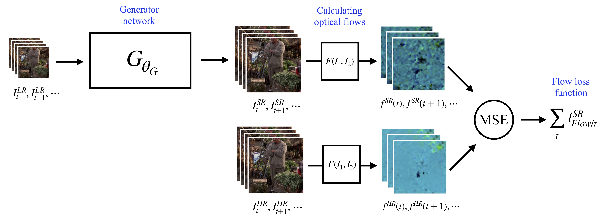
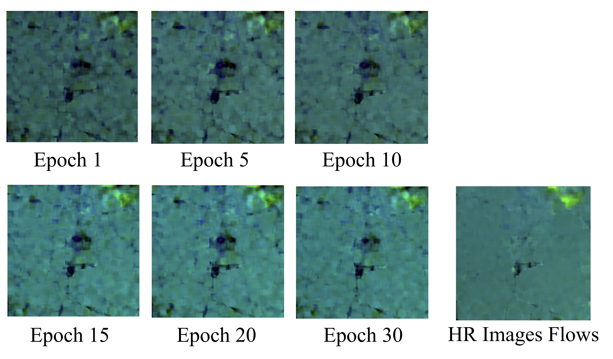
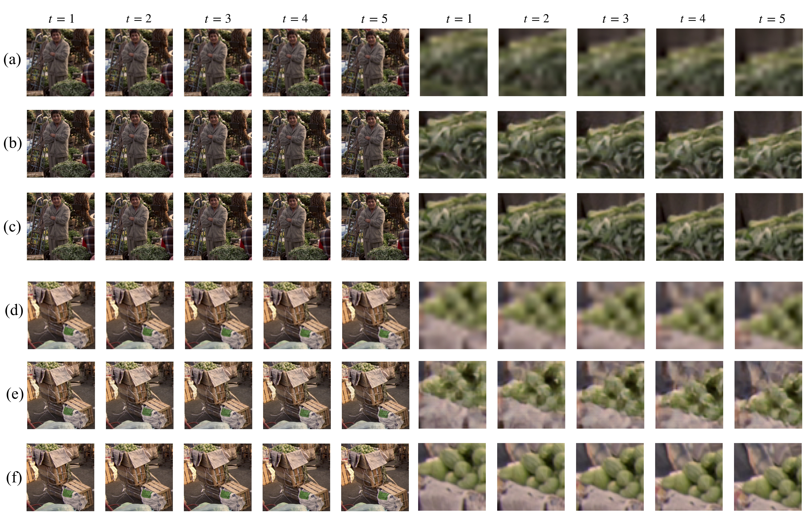

# SRGAN + Flow Loss
## W4731 Computer Vision Final Project: Video Superresolution

In this project, a loss function to improve upon the baseline approach which simply applies image supperresolution to each frame will be proposed. Based on the [SRGAN](https://github.com/tensorlayer/srgan) proposed by [Photo-Realistic Single Image Super-Resolution Using a Generative Adversarial Network](https://arxiv.org/abs/1609.04802), we propose a novel specific loss function which does not take only one single frame but a bundle of temporally neighbouring frames into the GAN. The model takes a sliding window of several consecutive frames as the input for generator network and outputs a bundle of consecutive SR frames. A perceptual loss function regarding both the single frame superresolution quality and the temporal continuity is proposed and the experimental results will evaluate the quality of superresolved videos using this loss function.

## Approach
A new loss function regarding both the single frame superresolution quality and the temporal continuity:

## Temporal Continuity
SR flows and HR flows comparison while training: SR flows become more and more similar to HR flows with more epochs trained.

## Superresolution Quality
Superresolution quality comparison: The first three rows show a clip of the video with a businessman, which includes (a) LR frame sequence; (b) SR frame sequence using our loss function; (c) HR frame sequence. The second three rows show a clip of the video of a basket of fruits, which includes (d) LR frame sequence; (e) SR frame sequence using our loss function; (f) HR frame sequence.

## Conclusion
In this project, we propose a novel specific loss function regarding both the superresolution quality and temporal continuity for video superresolution based on SRGAN. Experimental results show that our method keep better temporal continuity. However, the SR frame image quality may drop using our method. The future work would focus in more experiments with bigger datasets and novel architecture of GAN to superresolve videos.
